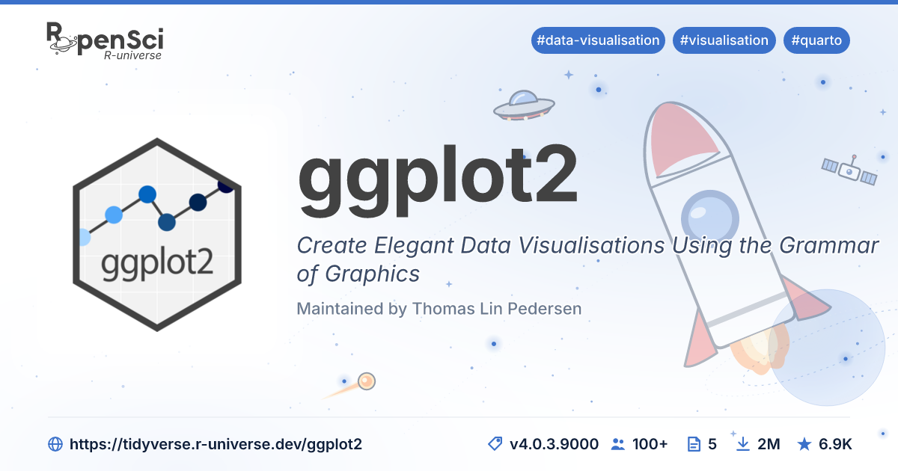

# r-universe-cards

Generate social-media preview cards (1200×630) for R-universe package pages,
in both SVG and PNG. Drop in the JSON blob from
`https://{owner}.r-universe.dev/api/packages/{package}` and you get a card
ready to drop into an `<meta property="og:image">` tag.



## Install

```sh
npm install r-universe-cards
```

This pulls in `@resvg/resvg-js` for PNG rasterisation. The package itself
ships the Inter font files needed for consistent rendering, so no system
fonts are required.

## Quick example

This is an ES module — use `import` syntax. The package generators return
SVG; pipe through `svgToPng()` for PNG.

```js
import { writeFile } from 'node:fs/promises';
import { generatePackageSvg, svgToPng } from 'r-universe-cards';

const owner = 'r-spatial';
const pkg = 'sf';
const url = `https://${owner}.r-universe.dev/api/packages/${pkg}`;

fetch(url)
  .then((res) => res.json())
  .then(generatePackageSvg)
  .then((svg) => writeFile('sf.png', svgToPng(svg)));
```

## API

### `generatePackageSvg(pkgJson)` → `Promise<string>`

Build the SVG card for a single package. `pkgJson` is the raw object
returned by `/api/packages/{name}`. Returns the SVG document as a UTF-8
string.

### `generateUniverseSvg(login)` → `Promise<string>`

Build the SVG card for an entire universe (org or user landing page).
Internally fetches `/api/summary` and `/api/topics?limit=5` from
`https://{login}.r-universe.dev`. Returns the SVG document as a UTF-8
string.

### `svgToPng(svg)` → `Buffer`

Rasterise an SVG card to PNG with `@resvg/resvg-js`. Synchronous —
returns a `Buffer` directly. Output is always 1200×630.

### `extractCardData(pkgJson)` → `object`
### `extractUniverseData({ login, summary, topics })` → `object`

Pure synchronous transformations from raw API JSON to the structured
card data (package or universe, respectively). Useful for logging or
building your own renderer.

### `renderPackageSvg(card, logo?)` → `string`
### `renderUniverseSvg(uni, logo?)` → `string`

Lower-level entry points. Take a card / universe object and an optional
logo descriptor and return the SVG synchronously. The high-level
`generate*` functions call these after fetching the logo; use them
directly if you want full control over the logo source.

## What ends up on the card

For each package, the renderer pulls these fields out of the API response:

| Card element | Source |
|---|---|
| Brand mark (top-left) | bundled `r-universe.dev/static/logo-big.svg` |
| Tags (top-right) | `_topics`, capped at 5 |
| Logo image | `_pkglogo`, fallback to `github.com/{owner}.png` |
| Package name | `Package` |
| Title | `Title` (italic) |
| Maintained by | `_maintainer.name` (fallback `Maintainer`) |
| URL (footer-left) | constructed from `_owner` and `Package` |
| Stats (footer-right) | `_stars`, `_downloads.count`, `_vignettes.length`, `_contributors.length`, `Version` |

## Examples

The [`examples/render-examples.js`](examples/render-examples.js) script
renders cards for a handful of packages with different shapes. After
`npm install`, run:

```sh
node examples/render-examples.js
```

Outputs land in `output/`:

| Package | Notes |
|---|---|
| [sf](output/sf.png) | hex logo, single maintainer, full tag row |
| [ggplot2](output/ggplot2.png) | hex logo, two-line title |
| [magick](output/magick.png) | no logo → org avatar (rOpenSci) |
| [curl](output/curl.png) | personal universe → circle-cropped user avatar |
| [RProtoBuf](output/RProtoBuf.png) | personal universe, mixed-case name |
| [scater](output/scater.png) | bioc → Bioconductor avatar, 16 topics capped to 5 |
| [commonmark](output/commonmark.png) | r-lib org avatar, longer title |

## License

MIT for the package code. The bundled Inter font is licensed under the
SIL Open Font License 1.1.
